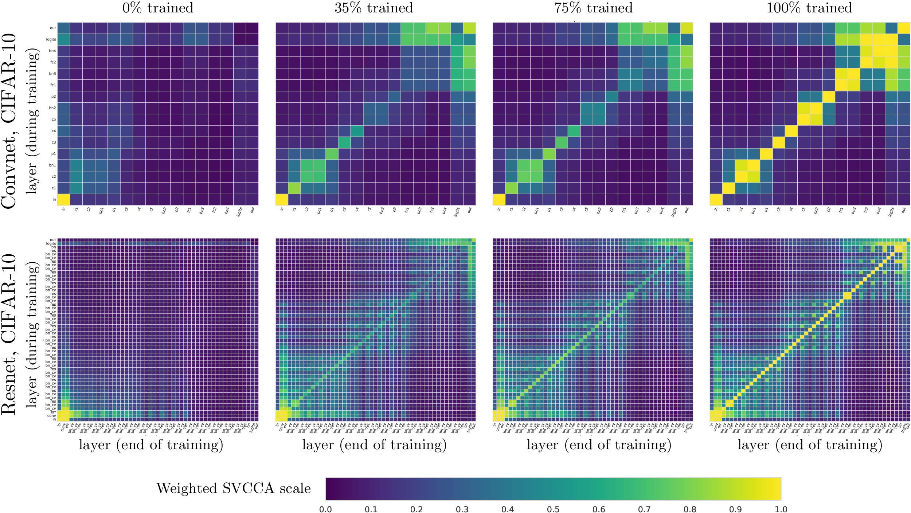
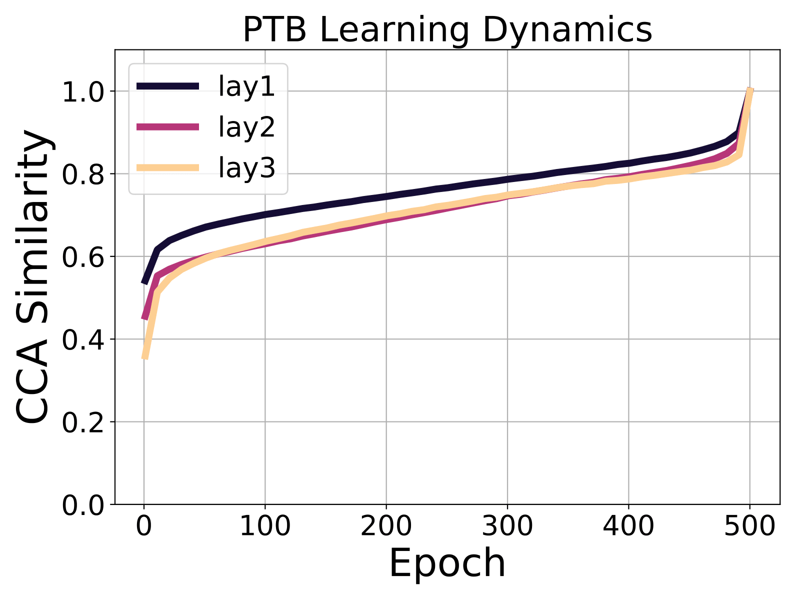
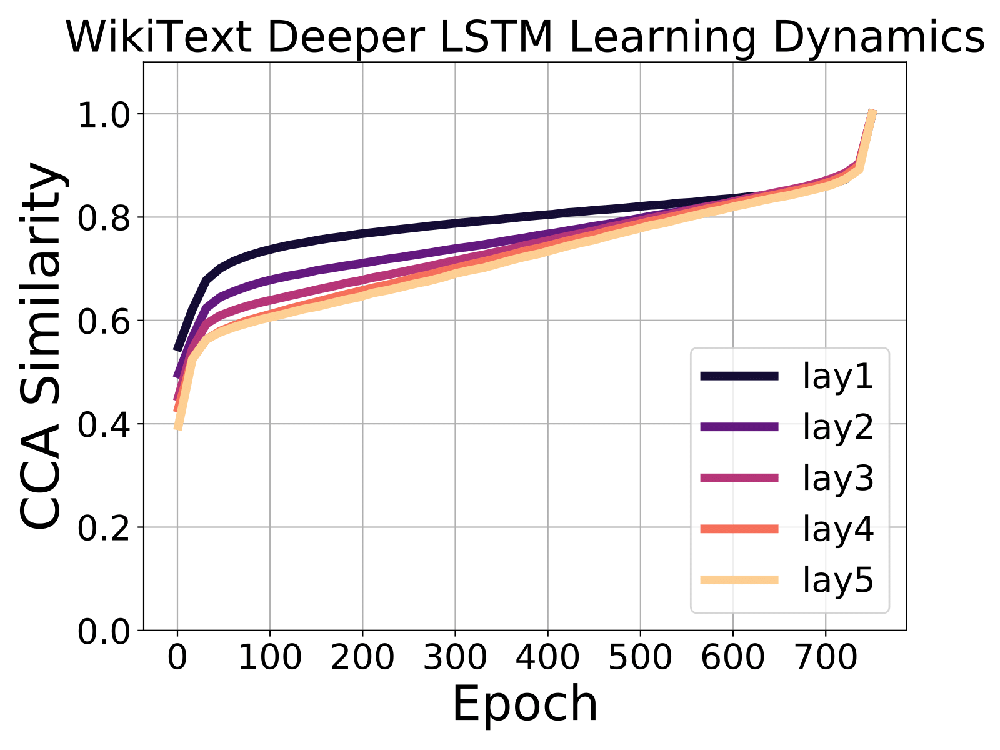
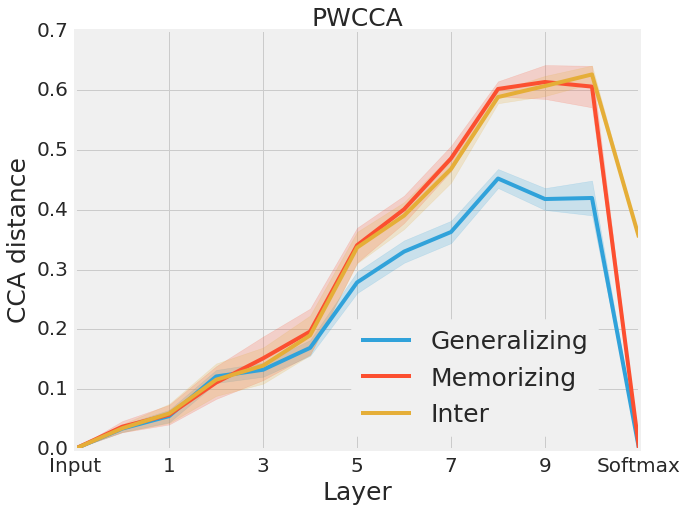
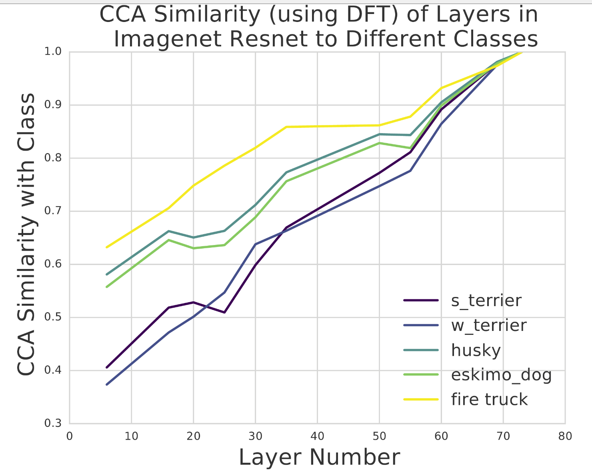

Disclaimer: This is not an official Google product.

Copyright 2018 Google Inc.

Licensed under the Apache License, Version 2.0 (the "License");
you may not use this file except in compliance with the License.
You may obtain a copy of the License at

https://www.apache.org/licenses/LICENSE-2.0

Unless required by applicable law or agreed to in writing, software
distributed under the License is distributed on an "AS IS" BASIS,
WITHOUT WARRANTIES OR CONDITIONS OF ANY KIND, either express or implied.
See the License for the specific language governing permissions and
limitations under the License.

## (SV)CCA for Representational Insights in Deep Neural Networks

This repository contains code and [jupyter notebook tutorials](https://github.com/google/svcca/tree/master/tutorials) on results in the following papers, as well as suggested extensions and open problems.
1. ["SVCCA: Singular Vector Canonical Correlation Analysis for Deep Learning Dynamics and Interpretability"](https://arxiv.org/abs/1706.05806). _Neural Information Processing Systems (NeurIPS) 2017_
2. ["Insights on Representational Similarity in Deep Neural Networks with Canonical Correlation"](https://arxiv.org/abs/1806.05759). _Neural Information Processing Systems (NeurIPS) 2018_

### Code Structure and Usage
The [tutorials](https://github.com/google/svcca/tree/master/tutorials) overview all of the main scripts, provide an example implementation of SVCCA, and also discuss existing applications and new directions. 

The main script is [cca_core](https://github.com/google/svcca/blob/master/cca_core.py) which can be used to compute CCA between two neural networks and outputs both the CCA correlation coefficients as well as the CCA directions. The CCA for Conv Layers tutorial outlines applications to convolutional layers.

Aside from this main script, implementations of _Partial Least Squares_, [numpy_pls.py](https://github.com/google/svcca/blob/master/numpy_pls.py) and PCA, [numpy_pca.py](https://github.com/google/svcca/blob/master/numpy_pca.py) are also provided. These methods are overviewed in the Other Methods Tutorial.

### Results from the Papers

#### Learning Dynamics
In both papers, we studied the per-layer learning dynamics: how different layers in a network converge through training. For both convolutional networks and recurrent neural networks, we found that lower layers tend to converge faster than higher layers. This means that not all layers need to be trained all the way through training. We can save ccomputation and prevent overfitting by consecutively freezing layers -- _freeze training_. Preliminary experiments support the effectiveness of freeze training, but there are many open questions (different architectures, varying learning rates) to explore further. 

    

The figures above show results for conv/resnets and language models on PTB and WikiText-2. This method also highlights other structural properties of the architecture. The 2x2 blocks in the conv net are caused by batch norm layers, which are representationally identical to the previous layer. We also see that residual layers in the resnet create grid like patterns, having higher representational similarity with previous layers.

#### Generalizing and Memorizing Networks
Following the experiment proposed in [Zhang et. al](https://arxiv.org/abs/1611.03530) we trained networks as normal on CIFAR-10 (generalizing networks), and on a fixed permutation of labels on CIFAR-10 (memorizing networks.) We then applied (PW)CCA to measure the layerwise similarity between (1) the group of generalizing networks (2) the group of memorizing networks (3) between generalizing and memorizing networks. In earlier layers, all three groups are about at similar. In higher (deeper) layers however, we see that (1) is much more similar than (2). Interestingly, (3) is _as similar as_ (2) -- surprising as the two sets of networks are trained on different tasks!

    

 

#### Interpreting the Latent Representations
While most of the results so far have focused on comparing two layers with CCA, we can also use it to compare the similarity between an intermediate vector, and a ground truth output vector, corresponding to a particular class. We perform this experiment with a subset of Imagenet classes (firetruck, husky, eskimo dog, two terriers) on the Imagenet Resnet. CCA similarity highlights differences between classes that are easier to learn -- learned much earlier in the network -- (e.g. firetruck) and harder classes, only learned much later on (e.g. husky). 

    

### References

If you use this code, please consider citing either or both of the following papers:

    @incollection{NIPS2017_7188,
    title = {SVCCA: Singular Vector Canonical Correlation Analysis for Deep Learning Dynamics and Interpretability},
    author = {Raghu, Maithra and Gilmer, Justin and Yosinski, Jason and Sohl-Dickstein, Jascha},
    booktitle = {Advances in Neural Information Processing Systems 30},
    editor = {I. Guyon and U. V. Luxburg and S. Bengio and H. Wallach and R. Fergus and S. Vishwanathan and R. Garnett},
    pages = {6076--6085},
    year = {2017},
    publisher = {Curran Associates, Inc.},
    url = {http://papers.nips.cc/paper/7188-svcca-singular-vector-canonical-correlation-analysis-for-deep-learning-dynamics-and-interpretability.pdf}
    }

<!-- comment to break blocks -->

    @incollection{NIPS2018_7815,
    title = {Insights on representational similarity in neural networks with canonical correlation},
    author = {Morcos, Ari and Raghu, Maithra and Bengio, Samy},
    booktitle = {Advances in Neural Information Processing Systems 31},
    editor = {S. Bengio and H. Wallach and H. Larochelle and K. Grauman and N. Cesa-Bianchi and R. Garnett},
    pages = {5732--5741},
    year = {2018},
    publisher = {Curran Associates, Inc.},
    url = {http://papers.nips.cc/paper/7815-insights-on-representational-similarity-in-neural-networks-with-canonical-correlation.pdf}
    }
